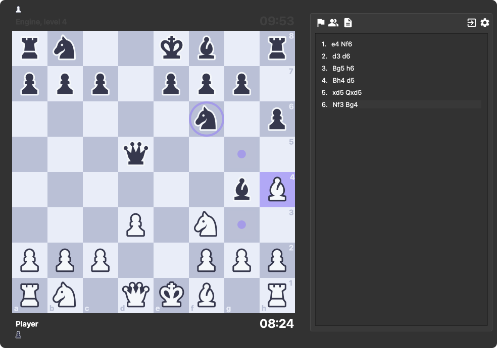
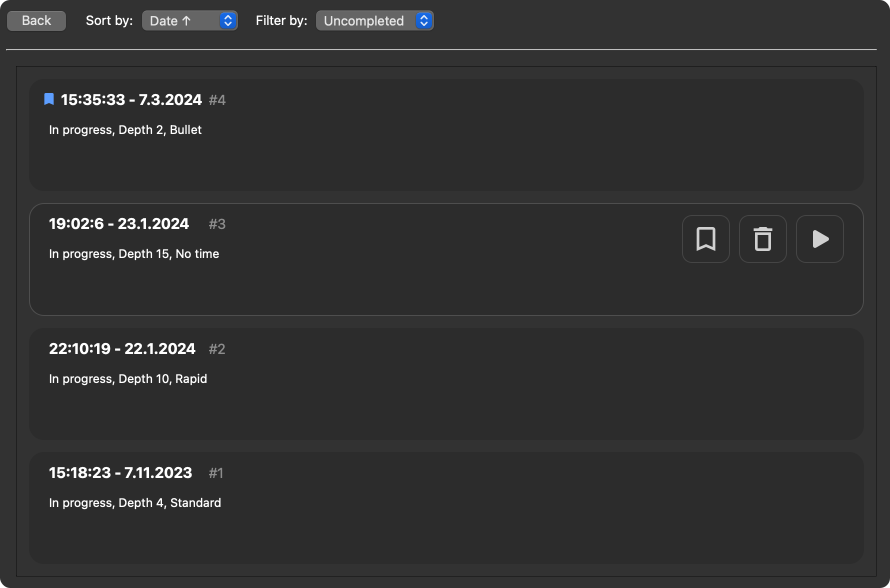
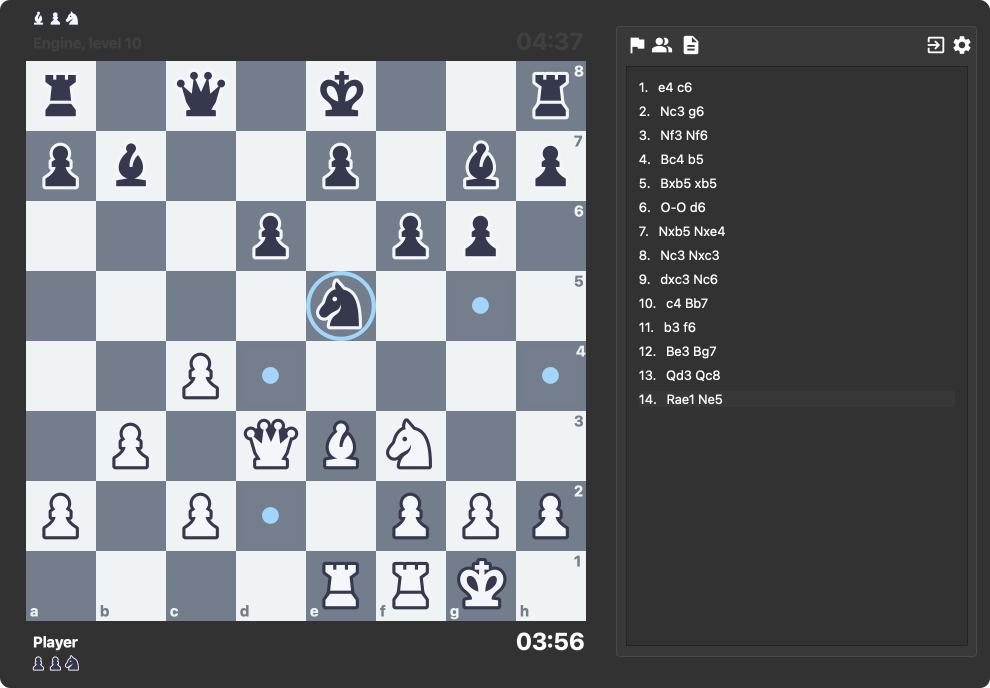

<p align="center"> </p>

---

**Chess Application and Engine** built using Python and the PyQt framework. Created originally as a **NEA** for my A-levels, but there are plans in place to finish all planned features. Currently there is no public release as this is a personal project, however documentation is available below for those who are interested in using the application.

### Manual Installation for macOS

* Copy the repository into the directory of your choice, and active the virtual environment:
```bash
source .venv/bin/activate
```
* Install the required dependencies:
```bash
pip install -r requirements.txt
```
* Finally run the main file `main.py` via:
```bash
python main/main.py
```
* You must also have the Stockfish installed on your system at the path via:
```bash
brew install stockfish
```
*Make sure the stockfish path is located at `/opt/homebrew/Cellar/stockfish/16/bin/stockfish`.*

## Features
An outline of the current features provided by the application.

### Intuitive and modern design
Emphasis on being a presentable final product alongside the application's core functionality.

<p align="center"></p>

### Saving and loading
Have the option to continue at a later date or even look over previous games with the saved game manager.

<p align="center"></p>

### Accessiblity and configurability
Numerous options for accessibility and configurations from board themes to time formats.

<p align="center"></p>

## Information

Windows and linux systems are not supported until a public release version is finished. If you do manually install this application on your macOS system, please [raise](https://github.com/nojustrusovas/cae/issues/new) any issues you may come across.

### Credits

* Chess pieces created by [Maciej Świerczek.](https://www.figma.com/@swierq)
* Stockfish developed and maintained by [the Stockfish community](https://github.com/official-stockfish/Stockfish/blob/master/AUTHORS) integrated into Python by [@zhelyabuzhsky.](https://github.com/zhelyabuzhsky)
* PySide6 binding developed and maintained by [the Qt Company.](https://wiki.qt.io/Qt_for_Python)
